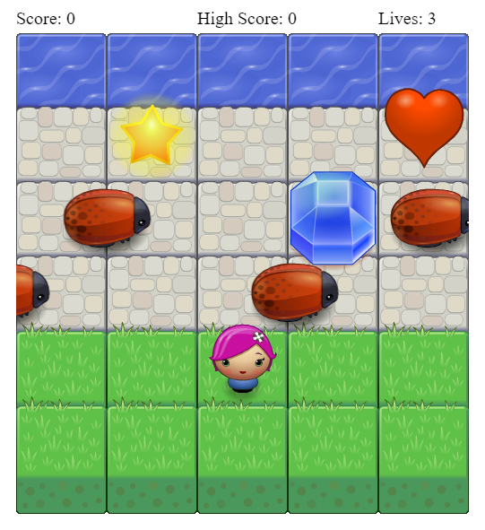
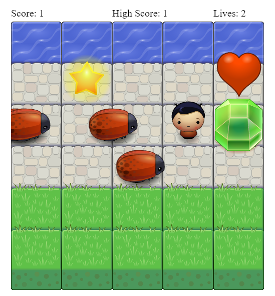

#[Udacity-Front-End-Nanodegree-Arcade-Game](https://github.com/udacity/frontend-nanodegree-arcade-game)
===============================

##Instructions for this Game
* This is Single Player Acrade Game
* Here you're the Player and the Bugs are Enemies 
* The goal of the player is to reach the water, without colliding into any one of the enemies
* Player can move left, right, up and down using the Arrow Keys
* The enemies move in varying speeds on the paved block portion of the scene
* Once the Player collides with an enemy, you lose one life (heart) and the game is reset
* Once the Player reaches the water he/she wins the Game
* Go on and set a new High Score

###In order to play the game, Follow the below steps:

* [Click here](https://soumya44.github.io/FEND-Classic-Acrade-Game/)  <b>OR</b>

1. Clone project:

    ```
    $ git clone https://github.com/Soumya44/FEND-Classic-Acrade-Game.git
    ```
2. Open ```index.html``` with your browser <b>OR</b>

2. Serve the application:

###Python 2.7
    ```
    $ python -m SimpleHTTPServer 3000
    ```

###Python 3.x
	```
	$ python3 -m http.server 3000
	```

3. Open the game:

    ```
    $ open "http://localhost:3000"
    ```
    <b>OR</b>
    Open ```http://localhost:3000``` with your browser

##Screenshots
<br>
<br>
<br>
<br>
<br>

###Feel Free To Contribute !

<br>

###Regards
Soumya Ranjan Behera
[LinkedIn]()
[soumyaranjanb02@gmail.com](mailto:soumyaranjanb02@gmail.com)
